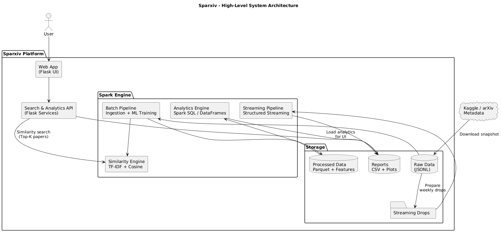
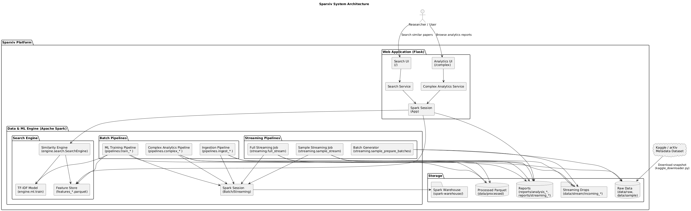

# Methodology

This document explains how Sparxiv turns raw arXiv metadata into:

- cleaned and normalized Parquet tables
- TF-IDF based text features
- exact similarity search over millions of papers
- batch and streaming analytics on authors, topics, and metadata quality

The goal is to keep the architecture simple enough to reproduce on a single machine while demonstrating realistic, large scale data engineering patterns.

---

## 1. System Architecture Overview

## 1.1 High-Level Architecture

## 1.2 Detailed System Architecture

At a high level, the system consists of:

1. Batch ingestion  
   Raw JSONL metadata is ingested into Spark, cleaned, and written as partitioned Parquet.

2. Feature engineering and model training  
   A Spark ML pipeline produces TF-IDF vectors on title plus abstract text.

3. Offline index building  
   For the full dataset, TF-IDF features are converted into a SciPy CSR matrix for low latency search.

4. Analytics layer  
   Complex Spark SQL queries compute category, author, and temporal statistics, both on batch and streaming inputs.

5. Web application  
   A Flask UI wraps the search engine and a browser for all CSV and PNG reports.

Two modes are supported:

- Sample mode: small sample for fast demos, in memory search.
- Full mode: full arXiv snapshot with a CSR index for scalable search.

---

## 2. Data Cleaning and Ingestion

### 2.1 Ingestion workflow

The ingestion entrypoints are:

- `pipelines.ingest_sample.py`
- `pipelines.ingest_full.py`

Both call a shared `run_ingestion` function that:

1. Reads the raw JSON or JSONL file.
2. Applies transformation functions to normalize text and metadata.
3. Filters out clearly unusable records, for example very short abstracts.
4. Writes Parquet partitioned by `year`.

Partitioning by year keeps queries on time based trends efficient and keeps directory layouts predictable for both batch analytics and streaming compatible transforms.

### 2.2 Text normalization

Titles and abstracts are cleaned using simple, deterministic rules:

- Lowercasing for consistent tokenization.
- Regex based removal of control characters and unusual whitespace.
- Preservation of LaTeX math markup inside the abstract where possible, instead of trying to fully strip it, since TF-IDF can tolerate some noise.

The design intentionally avoids heavyweight LaTeX parsing to keep the ingestion step fast and robust. TF-IDF is resilient enough that occasional markup tokens do not dominate the vocabulary once stopword filtering is applied.

### 2.3 Structural normalization

The ingestion logic aligns the JSON fields with a stable relational schema:

- Extracts `year` from `update_date` or the earliest `versions` entry.
- Parses `submitted_date` into a timestamp where it exists.
- Normalizes `journal-ref` and `report-no` into snake case column names.
- Derives `primary_category` as the first category token.
- Splits `categories` into `categories_list`.

Authors are normalized by preferring `authors_parsed` where available and falling back to string splitting on `authors`. The result is an `authors_list` array plus a `num_authors` count used for collaboration analyses.

A length filter such as `min_abstract_len=40` removes records whose abstracts are too short to be meaningful for text modeling, which reduces noise and vocabulary fragmentation.

---

## 3. Feature Engineering

### 3.1 Text pipeline design

The feature pipeline is defined in `engine.ml.featurization` and built via `build_text_pipeline`:

1. RegexTokenizer  
   Splits on non letter characters, lowercases, and emits tokens long enough to be meaningful.

2. StopWordsRemover  
   Combines:
   - default English stopwords
   - a small curated list of domain generic terms such as "paper", "results", "method"
   - an optional set of data driven extra stopwords, using the highest document frequency tokens

3. Optional bigrams  
   The design allows adding a bigram `NGram` stage with concatenation back into the token stream, but bigrams are disabled in the provided pipelines to keep vocabulary size and memory usage manageable.

4. CountVectorizer  
   Builds a sparse term frequency vector with a fixed `vocabSize` and `minDF` threshold to ignore extremely rare tokens.

5. IDF  
   Applies inverse document frequency weighting on top of raw counts.

6. Normalizer  
   L2 normalizes the TF-IDF vector, which makes cosine similarity equivalent to the dot product.

The pipeline expects an input column `text` and outputs `features_norm`. A thin wrapper concatenates title and abstract into `text` before training.

### 3.2 Hyperparameter choices

Two configurations are used:

- Sample model  
  - `vocab_size = 80000`  
  - `min_df = 3`  
  - `extra_stopwords_topdf = 200`  

- Full model  
  - `vocab_size = 120000`  
  - `min_df = 10`  
  - `extra_stopwords_topdf = 0`  

The full model uses a higher minimum document frequency to reduce memory pressure and training time over millions of documents. The sample model uses more aggressive stopword learning to keep quality high on a smaller corpus.

---

## 4. Similarity Search Design

Similarity search is handled by `engine.search.search_engine.SearchEngine` and operates in two modes.

### 4.1 Sample mode: in memory sparse vectors

For the sample dataset:

1. The trained TF-IDF pipeline and feature Parquet are loaded into Spark.
2. All feature rows are collected to the driver as `SparseVector` objects plus associated metadata.
3. Incoming queries are vectorized through the same pipeline.
4. Cosine similarity is computed in pure Python or NumPy by sparse dot product.

This mode keeps query latency low and is simple to reason about. The tradeoff is that it only scales to the sample size that fits in memory.

### 4.2 Full mode: CSR index

For the full dataset:

1. `pipelines.build_full_index.py` reads `features_full` using `pyarrow.dataset`.
2. Each TF-IDF `SparseVector` is turned into index and value arrays.
3. A global SciPy `csr_matrix` is constructed with shape `(num_docs, vocab_dim)`.
4. Side car NumPy arrays store metadata fields like `id_base`, `paper_id`, `title`, `abstract`, `categories`, and `year`.

At query time:

1. The query is vectorized to a single `SparseVector`.
2. It is expanded into a dense float32 vector of the same dimension as the CSR matrix.
3. Scores are computed with a single `csr_matrix @ query_vector` multiplication.
4. The top K indices are pulled and mapped back to metadata arrays.

This avoids Spark cross joins per query and keeps the hot path running entirely in Python and native BLAS code.

---

## 5. Query Design for Analytics

### 5.1 Standard queries

Standard query pipelines compute descriptive statistics over the ingested Parquet:

- Papers per year.
- DOI coverage per year via `has_doi`.
- Category distributions and Pareto charts based on `primary_category`.
- Text length summaries for titles and abstracts.
- Version count histograms using `n_versions`.
- Top authors by publication count.
- Completeness of key metadata fields.

These reports are written to:

- `reports/standard_queries_sample/`
- `reports/standard_queries_full/`

and are designed to be simple Spark SQL and DataFrame aggregations.

### 5.2 Complex analytics

The complex analytics module builds a richer `papers_enriched` view and then runs ten higher level analyses including:

1. Category co occurrence  
2. Author collaboration over time  
3. Rising and declining topics  
4. Readability and lexical richness trends  
5. DOI versus versions correlation  
6. Author productivity lifecycle  
7. Author category migration  
8. Abstract length versus popularity  
9. Weekday submission patterns  
10. Category stability by versions  

Each analysis outputs both CSV tables and PNG figures under:

- `reports/analysis_sample/`
- `reports/analysis_full/`

---

## 6. Streaming Methodology

The streaming jobs simulate weekly or periodic metadata drops:

1. Batch preparation  
   `streaming.sample_prepare_batches.py` slices the sample JSONL into multiple weekly files named `arxiv-sample-YYYYMMDD.jsonl`.

2. Streaming ingestion  
   `streaming.sample_stream.py` and `streaming.full_stream.py` watch an input directory for new files and use Spark Structured Streaming to process them.

3. Shared transform  
   Each microbatch is passed through a common transform function to align schema and derived columns with the batch pipeline.

4. Per drop reports  
   For each date stamp, per drop CSV and PNG summaries are emitted under `reports/streaming_sample/YYYYMMDD/` or `reports/streaming_full/YYYYMMDD/`.

The same metrics computed in standard queries are recomputed incrementally on each drop, demonstrating how batch style analytics can be adapted to streaming.

---

## 7. Evaluation Strategy

This project focuses on:

- Reproducibility  
  Every step is scripted so that another user can reproduce both the feature tables and plots from raw data.

- Plausibility and sanity checks  
  Checks include:
  - inspecting schema and partitioning for ingestion
  - checking vocabulary size and sparsity statistics for TF-IDF
  - validating that rising topics and category distributions match domain expectations

- Qualitative search evaluation  
  Search quality is assessed using:
  - example queries for known topics
  - manual inspection of top K neighbors for thematic consistency
  - spot checks between sample and full models to see whether patterns carry over

More advanced recommender evaluations such as click logs or human relevance judgments are out of scope for this project but the architecture is designed so that such signals could be integrated later.
